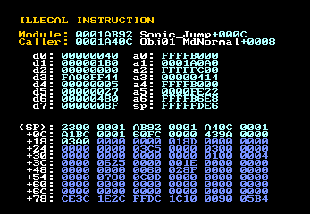
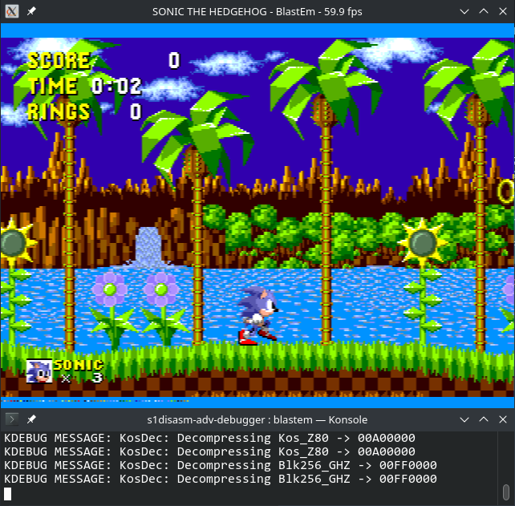

# MD Debugger and Error Handler

 

___MD Debugger and Error Handler___ (or simply "MD Debugger", also known as _"The Advanced Error Handler and Debugger"_) is a ready-to-use error handler that comes with a powerful integrated debugger. It aims to provide robust and extensible debugging tools built-in directly into the Mega-Drive ROM, that can be used anywhere (from emulators to the real hardware).

Currently, it targets **The AS Macroassembler** and **ASM68K** assemblers. It has installation instructions and full support for the mainline Sonic disassemblies, but it can be intergated into any AS or ASM68K project (both the error handler and debugger) or even any pre-existing ROM (error handler only in a binary form).

## Features

- __Debug symbol support.__
  - It can extract symbols from AS and ASM68K at build time and bundle them with the ROM;
  - Debug symbols are efficiently compressed to save space and stored in custom database-like format; they are **not** visible as plain-text.
  - Error dumps will display symbols from your source code instead of raw offsets, making debugging crashes times more easier;

- __Backtrace support, caller guessing and more.__
  - Press the B button on the exception screen to display the backtrace and see the full call chain that led to the exception;
  - Press the A button to display which symbols address registers point to;
  - Generic exception screen displays a caller out-of-the box.

- __Detailed and informative exceptions.__
  - Generic exception screen is as detailed and informative as possible;
  - See exception location, caller address, all the main CPU registers, stack dump and more;
  - Additional details can be displayed like VInt and HInt addresses (if dynamic) as well as `USP` and `SR` registers.

- __Easily write your own debuggers with "high-level" macros.__
  - Write your own debug programs to display what you need;
  - Use "high-level" macros that debugger environment provides, like `Console.Write "My d0 is %<.w d0 hex>"`;
  - Formatted string syntax in the debugger is extremely powerful: display any value from any memory location as: hexidecimal, decimal, binary, signed, unsigned, symbol or even a null-terminated ASCII string. Control output by modifying colors or adding line breaks.

- __Throw custom exceptions and customize error handling.__
  - You can throw custom exceptions at any time using `RaiseError` macro;
  - Use your own debug programs in exceptions if needed;
  - Customize generic exception screen showing or hiding some less frequently used exception details;
  - Map your debug programs to buttons on the exception screen.

- __Assertions.__
  - Use one of the most powerful debugging techniques and take advantage of self-testing code!
  - Assertions, widely adopted by many high-level languages, are provided by the debugger out-of-the box;
  - Use `assert` pseudo-instruction that is only compiled in DEBUG builds. This means zero run-time cost for your final (RELEASE) builds to implement self-testing code.

- __KDebug integration for logging, breakpoints and cycle-couting (experimental).__
  - Display formatted strings at any point straight in your emulator's debug console!
  - Use a similar "high-level" macro interface as in console programs (`KDebug.WriteLine` instead of `Console.WriteLine`), but without interrupting your programs;
  - Currently, the only emulators to support KDebug are Gens KMod and Blastem-nightly;
  - Create manual breakpoints with `KDebug.BreakPoint`;
  - Measure your code performance using `KDebug.StartTimer` and `KDebug.EndTimer`.

- __Easy to install and extremely lightweight.__
  - Error handler blob is below 3 KiB, which is quite small for the number of features it provides; optional debugger extensions take a few hundreds of bytes each;
  - It's quite easy to install, with installation instructions and ready configurations provided for the most mainline Sonic disassemblies.

## Installation instructions

Installation instructions are provided for:

- [Sonic 1 GitHub Disassembly (AS version)](docs/installation/Sonic_1_Github_AS.md)
- [Sonic 1 GitHub Disassembly (ASM68K version)](docs/installation/Sonic_1_Github_ASM68K.md)
- [Sonic 1 Hivebrain 2005 Disassembly](docs/installation/Sonic_1_Hivebrain_2005.md)
- [Sonic 1 Hivebrain 2022 Disassembly](docs/installation/Sonic_1_Hivebrain_2022.md)
- [Sonic 2 GitHub Disassembly](docs/installation/Sonic_2_Github.md)

If you'd like to contribute new installation instructions or update the existing ones, feel free to open a Pull Request: https://github.com/vladikcomper/md-modules/pulls

## Documentation and help

### Guides

- [Powerful debugging techniques](docs/how-to/Debugging_techniques.md)
- [How-to add your details in exception headers](docs/how-to/Modify_exception_header.md)
- [Using KDebug intergration](docs/how-to/Use_KDebug_integration.md)
- [Troubleshooting](docs/how-to/Troubleshoot.md)

### References

- [Debugger macro reference](docs/Debug_macros.md)
- [Formatted string format reference](docs/Formatted_strings.md)

## Supported assemblers

Currently, the *Advanced Error Handler and Debugger 2.0* supports integration with the following assemblers:

* __ASM68K__ (`bundle-asm68k`)
* __The AS Macroassembler__ v.1.42 Bld 55 and above (`bundle-as`)

> **Warning**
>
> The AS Macroassembler version has limited support for some features

## Version History

### Version 2.5 (2023-06-30)

- Introduced debugger extensions and the following new built-in debuggers:
  - Backtrace debugger (mapped to the B button by default);
  - Address register debugger (mapped to the A button by default).
- Upgraded ConvSym from version 2.0 to 2.9.1. The adds the following major features for debug symbol generation:
  - Stable AS support;
  - Improve symbol data compression by force-converting your symbols to upper or lowecase;
  - Support for multiple labels on the same offset;
  - Support for symbols in RAM section (must be properly implemented in your project);
  - Advanced offset transformations: mask, upper/bottom boundary, add/subtract base address;
- Added `assert` macro.
- Implemented `KDebug` integration with the following new macros:
  - `KDebug.WriteLine`
  - `KDebug.Write`
  - `KDebug.BreakLine`
  - `KDebug.BreakPoint`
  - `KDebug.StartTimer`
  - `KDebug.EndTimer`
- Added additional `Console.*` macros:
  - `Console.Clear`
  - `Console.Pause`
  - `Console.Sleep`
- Improve readability of offsets and symbols in the exception header;
- Renamed "Module:" field in exception header to "Offset:" for clarity;
- **ASM68K version:** Support "case-sensitive" compile-flag;
- **AS version:** Most of the M68K addressing modes are now supported in formatted strings. The following examples now work:
  - `%<.w #1234>`
  - `%<.w #SomeSymbolAsValue>`
  - `%<.l $FF0000>`
  - `%<.b 1(a0)>`
  - `%<.b something(a0)>`
  - `%<.b SomeLabel(pc)>`
- **AS version:** Add a workaround for an assembler bug in older builds of AS which may cause some instructions to be misaligned;
- **AS version:** Macro invocations (`Console.*`, `RaiseError`) no longer break local labels if placed in-between them;
- **AS version:** Prefer `!align` instead of `align` to avoid issues if it's overridden in the project;
- **AS version:** Support "case-sensitive" compile flag;
- Support full address range for stack pointer (previous version only correctly worked with $FF8000-$FFFFFF range due to optimizations);
- Introduce "External symbol table" bundles for both AS and ASM68K versions, which uses a reference to the symbol table instead of expecting it right after the Error Handler blob;
- Fixed a rare case of buffer overflow when displaying offset as a symbol with displacement;
- Code-size optimizations, minor bugfixes and stability improvements.

### Version 2.0 (2018-01-14)

The original version 2.x release
