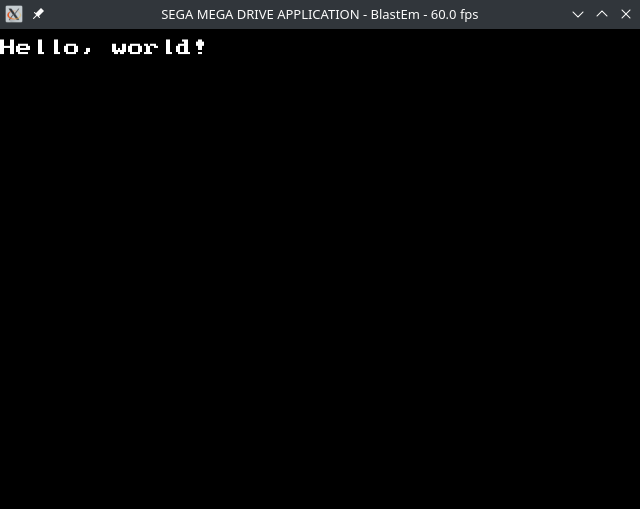

# MD Shell

**MD Shell** is a stand-alone easy to use "assembly header" for creating small console-based programs on Sega Mega-Drive / Genesis. It provides minimal but robust run-time environment with the ROM header, entry point and "high-level" macros for printing formatted texts.



MD Shell can be used for quickly sketching test ROMs or learning M68K assembly in a friendly environment with accessible debug printing (without side-effects). It has all the features of MD Debugger and Error Handler built-in.

## Simple Hello World

Once you include `MDShell.asm` header/object, you can write a simple console program in 3 lines of code:

```
	include "MDShell.asm"

Main:
	Console.WriteLine "Hello, world!"
	rts
```

Each program should define "Main:" as an entry point.

Anywhere in your code you can access `Console` and `KDebug` objects and call `RaiseError`.

## Building from source code

Please refer to [BUILD.md] for build instructions.

## Bundles and supported assemblers

**MD Shell** provides several flavors of headers/objects dubbed "bundles" (similarly to MD Debugger) that target various popular 68K assemblers. Currently, the following bundles are provided:

* `asm68k` (recommended) - a complete header with blob targetting the _ASM68K assembler_;
* `asm68k-linkable` - header and an object file for the _ASM68K assembler_, for with advanced build systems where _Psy-Q Linker_ is required;
* `as` - a complete header with blob targetting the _AS Macroassembler_ (v.1.42 Bld 55 and above);
* `headless` - blob-only version, that should be compatible with any ASM68K assembler; it's mostly useless since macros aren't included.

> [!WARNING]
>
> The AS Macroassembler version has limited support for some features!

## Documentation

- [Macros reference](docs/Macros_reference.md)
- [Formatted string format reference](docs/Formatted_strings.md)

## Version history

### Version 2.6 (WORK-IN-PROGRESS)

- Introduce new `asm68k-linkable` bundle which targets Psy-Q Linker;
- Optimize `Console.WriteLine`, `Console.Write` when string doesn't include printable arguments;
- Add support for `KDebug` integration with the following new macros:
  - `KDebug.WriteLine`
  - `KDebug.Write`
  - `KDebug.BreakLine`
  - `KDebug.BreakPoint`
  - `KDebug.StartTimer`
  - `KDebug.EndTimer`
- Support user-defined `VBlank` and `HBlank` interrupt handlers (`asm68k` and `as` bundles only);
- **ASM68K version:** Replace `endc` directives with `endif` for readability;
- Replace `__global__*` prefix for exported labels with `MDDBG__*`;
- Use larger text buffer for all `.WriteLine` and `.Write` calls (this reduces number of flushes and improves performance);

### Version 2.5

- **ASM68K version:** Support "case-sensitive" compile-flag;
- **AS version:** Most of the M68K addressing modes are now supported in formatted strings. The following examples now work:
  - `%<.w #1234>`
  - `%<.w #SomeSymbolAsValue>`
  - `%<.l $FF0000>`
  - `%<.b 1(a0)>`
  - `%<.b something(a0)>`
  - `%<.b SomeLabel(pc)>`
- **AS version:** Add a workaround for an assembler bug in older builds of AS which may cause some instructions to be misaligned;
- **AS version:** Macro invocations (`Console.*`, `RaiseError`) no longer break local labels if placed in-between them;
- **AS version:** Prefer `!align` instead of `align` to avoid issues if it's overridden in the project;
- **AS version:** Support "case-sensitive" compile flag;
- Fixed a rare case of buffer overflow when displaying offset as a symbol with displacement;
- Added `assert` macro.
- Added additional `Console.*` macros:
  - `Console.Clear`
  - `Console.Pause`
  - `Console.Sleep`
  - Major MD Debugger improvements:
  - Introduced debugger extensions and the following new built-in debuggers:
    - Backtrace debugger (mapped to the B button by default);
    - Address register debugger (mapped to the A button by default).
  - Support full address range for stack pointer (previous version only correctly worked with $FF8000-$FFFFFF range due to optimizations);
  - Improve readability of offsets and symbols in the exception header;
  - Renamed "Module:" field in exception header to "Offset:" for clarity;
- Upgraded ConvSym from version 2.0 to 2.9.1. The adds the following major features for debug symbol generation:
  - Stable AS support;
  - Improve symbol data compression by force-converting your symbols to upper or lowecase;
  - Support for multiple labels on the same offset;
  - Support for symbols in RAM section (must be properly implemented in your project);
  - Advanced offset transformations: mask, upper/bottom boundary, add/subtract base address;
- Code-size optimizations, minor bugfixes and stability improvements;

### Version 2.0

The initial version 2.x release
